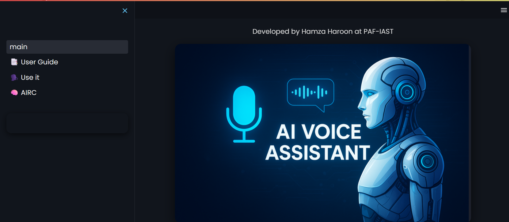
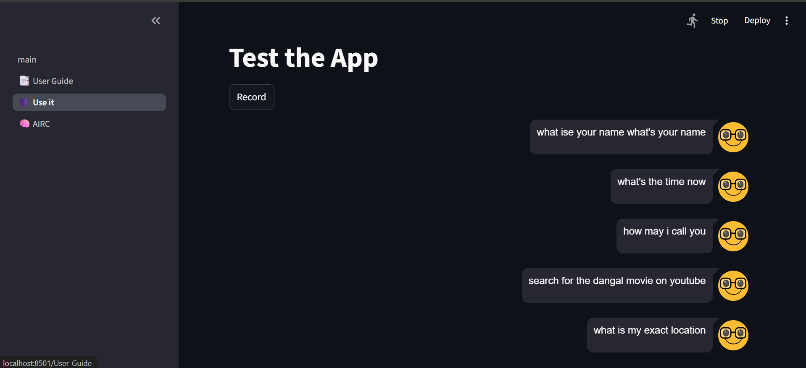

# 🚀 AI Voice Assistant (Streamlit + Speech Recognition)

A real-time **AI-powered Voice Assistant** that listens, understands, and responds to human speech.  
It combines **Speech Recognition, Natural Language Processing, and Text-to-Speech (TTS)** with a modern **Streamlit web interface** to deliver a seamless conversational experience.

---

# 🎯 Key Highlights

- 🎙️ Real-time speech-to-text conversion  
- 🧠 Intelligent intent detection using NLP logic  
- 🔊 Natural text-to-speech responses  
- 🌐 Automated web actions (Google, YouTube, Maps, Weather, Stocks)  
- 💻 Interactive Streamlit UI (dark professional theme)  
- ⚡ Lightweight, fast, and fully functional AI assistant  

---

# 📌 Project Overview

This project simulates a **personal AI assistant** that can understand voice commands and perform intelligent actions.

### 🔹 Workflow:
1. Captures voice input via microphone  
2. Converts speech into text using Google Speech Recognition  
3. Processes intent using keyword + fuzzy matching  
4. Generates appropriate response  
5. Speaks response using TTS engine  
6. Executes actions like web search or system queries  
7. Displays everything in a clean Streamlit dashboard  

---

# 🧠 Methodology

## 🎤 Input Processing
- Microphone captures audio input  
- Speech is converted to text using Google Speech Recognition  
- Error handling ensures robustness  

## 🧩 Natural Language Understanding
- Intent detection using keyword matching  
- Fuzzy logic improves flexibility in commands  
- Recognizes greetings, queries, and actions  

## 💬 Response Generation
- Generates contextual responses  
- Uses **pyttsx3** for offline speech synthesis  
- Provides human-like interaction experience  

## ⚙️ Action Execution
Supports intelligent automation such as:
- 🌍 Google Search  
- 🎬 YouTube Search  
- 📍 Google Maps Navigation  
- 🌦️ Weather Queries  
- 📈 Stock Market Search  
- ⏰ Current Time  

## 🖥️ Streamlit UI Layer
- Dark-themed modern dashboard  
- Organized sections (features, logs, instructions)  
- Real-time interaction display  
- Clean and professional layout  

---

# 🛠️ Tools & Technologies

- Python 3  
- Streamlit  
- speech_recognition  
- pyttsx3 (Text-to-Speech)  
- webbrowser  
- NLTK (Natural Language Processing)  
- Pillow (PIL)  

---

# 🏗️ System Architecture

🎤 Input Layer  
→ Speech Recognition (Voice → Text)  

🧠 Processing Layer  
→ Intent Detection + NLP Logic  

⚙️ Action Layer  
→ Web search / time / weather / system commands  

🔊 Response Layer  
→ Text + Voice Output  

💻 UI Layer  
→ Streamlit Dashboard  
## 📸 Project Screenshots

### 🏠 Home Interface

  

---

### 📍 Live Location Feature

  

---

### 🤖 Robot Working Demo

  

---

# ⭐ Key Features

- 🎙️ Real-time voice interaction  
- 🧠 Smart intent recognition  
- 🔊 Natural AI speech responses  
- 🌐 Automated web-based actions  
- ⏰ Time, weather & location queries  
- 💬 Personalized user interaction  
- 🎨 Modern dark-mode UI  
- ⚡ Lightweight and fast execution  

---

# 📈 Expected Outcomes

- Fully functional AI voice assistant  
- Interactive web-based AI demo  
- Understanding of speech processing & NLP workflow  
- Foundation for advanced conversational AI systems  

---

# 🔮 Future Enhancements

- Integration with GPT / Gemini models  
- Emotion & tone detection from voice  
- IoT device control using voice commands  
- Mobile and desktop application versions  
- Advanced analytics dashboard  

---

# 👨‍💻 Author

**Hamza Haroon**  
AI Student | Machine Learning & Computer Vision Developer  

📧 Email: hamzamehmoodkhan1245@gmail.com  
🔗 GitHub: https://github.com/hamzamehmoodkhan1245  

---

# ⭐ If you like this project

Give it a ⭐ on GitHub and feel free to contribute or improve it!
